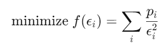
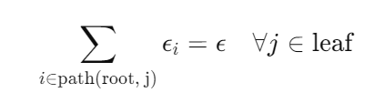
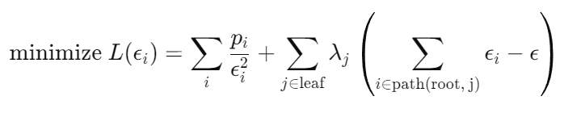
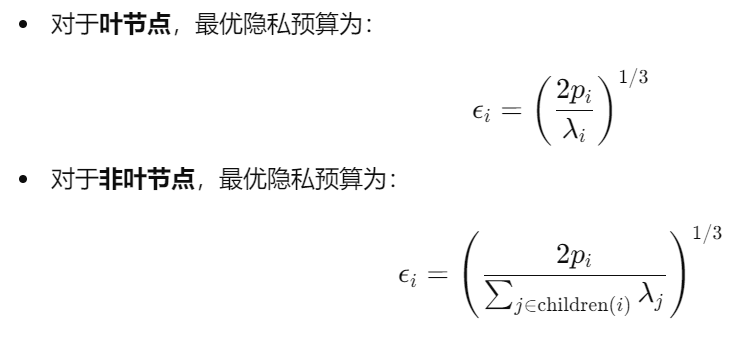

# Optimization of Privacy Budget Allocation In Differential Privacy-Based Public Transit Trajectory Data Publishing for Smart Mobility Applications

## 1. 研究目的
该文章旨在开发一种优化隐私预算分配的算法，用于在智能交通应用中基于差分隐私（Differential Privacy, DP）发布公共交通轨迹数据。研究的重点是解决在发布轨迹数据时隐私保护与数据实用性之间的冲突问题。具体目标是通过优化差分隐私的预算分配，减少查询误差，从而确保发布的轨迹数据具有更高的实用性，同时严格满足差分隐私的要求。

在公共交通系统中，轨迹数据是重要的研究资源。然而，这些数据可能会带来隐私泄露的风险。传统方法简单地分配隐私预算，如均匀分配在树的各个层次上，但未能达到最优效果。因此，该研究的目标是开发一种理论上有依据且实践中可验证的最优隐私预算分配模型，旨在提高数据的准确性和效用，并降低隐私泄露的风险。

## 2. 研究方法
文章提出了一种新的隐私预算分配算法，主要包含以下步骤：

1. **数据表示**：轨迹数据以前缀树的形式表示，其中每条轨迹被表示为一个节点及其相关的子节点，树的深度表示轨迹的长度。

2. **查询概率模型**：开发了一个查询概率模型，用来定量衡量每个节点（即轨迹对）的查询频率。查询频率越高，加入噪声后对数据实用性的影响就越大，因此需要更多的隐私预算。

3. **隐私预算分配优化**：通过拉格朗日松弛法推导出最优隐私预算分配值。优化的目标是在满足差分隐私的条件下，最小化查询误差。研究对所有的树节点分配隐私预算，且每个节点的预算取决于查询的概率和节点的敏感性。

4. **实证分析**：使用来自中国深圳地铁的真实智能卡数据进行实验，评估该算法在不同隐私预算设置下的性能。这些数据包括2.8百万个个体的旅行记录，共计超过2.2亿条记录。通过对比三种基准算法，证明了该方法在数据效用和运行时间上的优势。

## 3. 算法主要内容
1. **数据表示**：轨迹数据是指由时间和位置配对组成的时空序列。例如，在公共交通系统中，轨迹数据记录了个体从一个地点到另一个地点的时间和位置序列。每条轨迹可以形式化为一组时间-位置对。前缀树是一种用于存储和表示轨迹数据的树状数据结构。每个节点表示轨迹中的某个位置，每条边表示从一个位置到另一个位置的时间顺序关系。根节点无实际意义，根节点的孩子节点表示每条轨迹的起点，叶子节点表示每条轨迹的终点。每个节点记录经过该位置的轨迹数量。

2. **查询概率模型的引入**：与以往简单的预算分配机制不同，文章通过查询概率模型定量衡量每个节点的查询频率，并根据节点的敏感性和查询频率优化隐私预算的分配。查询频率高的节点会分配到更多的隐私预算，从而减少噪声引入对数据实用性的负面影响。
- 查询概率的计算是层次化进行的。具体步骤如下：
  - 从叶节点开始：首先计算叶节点的查询概率。因为叶节点代表轨迹的终点，查询概率较为简单，直接根据轨迹总数N进行计算。
  - 向上递归计算非叶节点：一旦叶节点的查询概率确定，就可以通过递归向上计算非叶节点的查询概率。每个非叶节点的查询概率是其自身被查询的概率加上其所有子节点查询概率的和。

3. **拉格朗日松弛法的应用**：在差分隐私领域，本文首次将拉格朗日松弛法用于隐私预算分配的优化，通过数学推导得出最优的隐私预算分配方式。这种方法在理论上具有坚实的基础，确保了预算分配的最优性。
- 具体步骤如下：
  - 目标函数(最小化查询误差)如上图所示：
    
  - 约束条件(轨迹的每个节点所分配的隐私预算之和等于总隐私预算)如下图所示：

  - 使用拉格朗日松弛法来将原问题转换为一个无约束的优化问题：

  - 最终求解结果为：

  - 拉格朗日乘子可以使用梯度下降法求解得到较优解。
4. **算法流程**：
- 
  - 输入数据并进行数据预处理，然后构建前缀树。
  - 隐私预算分配，预算分配是根据各节点的查询概率和前缀树的层次结构来确定的，确保总预算被合理分配到前缀树的各个节点。
  - 逐层处理节点，从树的根节点开始，按层遍历前缀树。为每个节点添加噪声。
  - 构建子树，为每个节点构建含噪声的子树，该过程会删除噪声计数小于该层次阈值的节点，在保证子节点噪声计数之和不超过父节点的噪声计数的前提下，为父节点新增合适的子节点。该过程新增子节点会继承父节点的隐私预算，须确保包含新增节点的轨迹总隐私预算不超过全局的预设的总隐私预算。
  - 输出处理过的轨迹数据。

## 4. 启发
1. **隐私保护与数据实用性的平衡**：该文章深入探讨了如何在发布数据时既保护隐私又确保数据的实用性，这是差分隐私研究中的核心问题。该研究展示了一种有效的平衡方式，通过优化隐私预算的分配，在确保隐私的同时最大化数据的效用。这为未来的差分隐私应用提供了重要的参考，尤其是在智能交通和其他大数据领域中。

2. **理论与实践的结合**：文章中的创新之处在于，提出的隐私预算分配模型不仅有理论支持，还通过实证分析验证了其在实际应用中的有效性。这为差分隐私算法的实际应用提供了很好的范例，说明理论上的优化方法能够在现实世界的数据发布场景中有效落地。

3. **多样化的隐私预算分配方法**：该研究强调了不同数据节点需要不同的隐私预算分配，而不是简单的均匀分配或基于层次的分配。未来的研究可以进一步探索更加细致的分配方法，以应对不同场景下的数据发布需求。

4. **对大数据应用的启示**：该算法能够处理大规模数据集，并在合理的时间范围内完成计算，说明其具有很好的可扩展性和应用潜力。尤其是在大数据应用日益普及的今天，如何高效地进行数据发布，同时保护隐私，已经成为一个迫切需要解决的问题，该研究在这方面提供了宝贵的经验。

